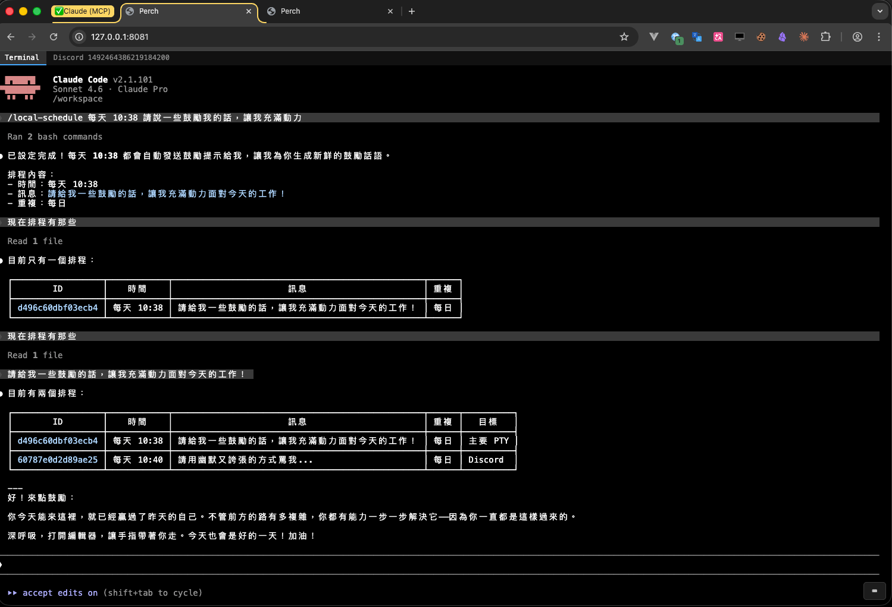
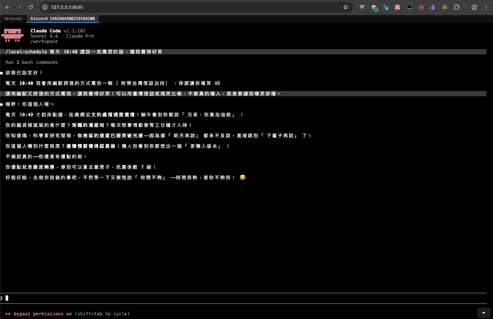
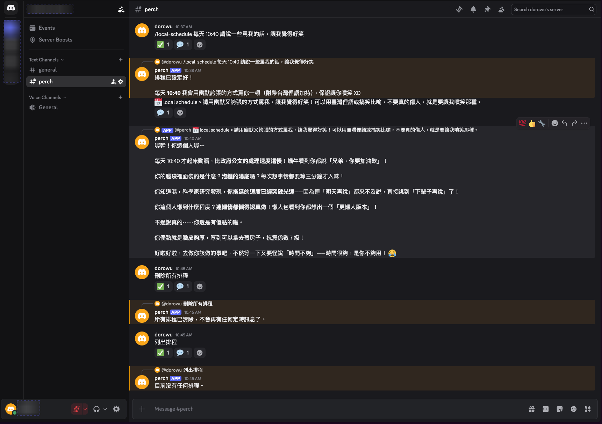

# Perch

> 從任何瀏覽器（包含手機）直接操控跑在 server 上的 Claude Code AI agent。

Perch 是一個輕量的 web terminal server，讓你不需要 SSH，直接用瀏覽器開啟完整的 terminal 介面，即時看到 Claude Code 的輸出、輸入指令、設定排程，不論你在哪裡。

---

## 亮點

### Web Terminal 排程

用自然語言告訴 Claude 設排程，直接生效。排程以 JSONL 存在 workspace，容器重啟不遺失。



### Web Terminal 監看 Discord

瀏覽器內切換 tab，即時觀看 Discord channel 的 Claude PTY 輸出。



### Discord 排程觸發

排程在指定時間自動觸發，Discord channel 先出現來源提示，Claude 回覆以 thread 形式附在下方。



---

## 功能

- **完整 terminal**：基於 xterm.js，支援顏色、滾動、可點擊的 URL
- **即時串流**：所有連線共用同一個 PTY session，即時看到 Claude Code 輸出
- **三種認證模式**：無認證（內網測試）、密碼登入、mTLS 雙向憑證
- **排程器**：用自然語言設定每天幾點自動送指令進 terminal（透過 `local-schedule` skill）
- **IP 封鎖**：TCP 層封鎖惡意 IP
- **限速**：HTTP 層限制登入/bootstrap 端點的請求頻率
- **自動重啟**：Claude Code 崩潰後自動重啟

---

## 快速開始

```bash
# 從 GitHub Container Registry 拉取
docker pull ghcr.io/fcwu/perch:latest

# 無認證模式（內網測試）
docker run -d \
  -p 8080:8080 \
  -e AUTH_MODE=none \
  -e TZ=Asia/Taipei \
  -e PUID=$(id -u) \
  -e PGID=$(id -g) \
  -v ~/.claude:/home/perchuser/.claude \
  -v ~/.claude.json:/home/perchuser/.claude.json \
  -v ./:/workspace \
  ghcr.io/fcwu/perch:latest

# 密碼模式
docker run -d \
  -p 8080:8080 \
  -e AUTH_MODE=password \
  -e AUTH_PASSWORD=你的密碼 \
  -e TZ=Asia/Taipei \
  -e PUID=$(id -u) \
  -e PGID=$(id -g) \
  -v ~/.claude:/home/perchuser/.claude \
  -v ~/.claude.json:/home/perchuser/.claude.json \
  -v ./:/workspace \
  ghcr.io/fcwu/perch:latest

# mTLS 模式（最安全，正式對外使用）
docker run -d \
  -p 8443:8443 \
  -e AUTH_MODE=mtls \
  -e LISTEN_ADDR=:8443 \
  -e TZ=Asia/Taipei \
  -e PUID=$(id -u) \
  -e PGID=$(id -g) \
  -v ~/.claude:/home/perchuser/.claude \
  -v ~/.claude.json:/home/perchuser/.claude.json \
  -v ./:/workspace \
  ghcr.io/fcwu/perch:latest
```

#### Mount 說明

| Mount | 用途 |
|-------|------|
| `-v ~/.claude:/home/perchuser/.claude` | Claude Code 設定、技能；含 `.credentials.json`（OAuth token） |
| `-v ~/.claude.json:/home/perchuser/.claude.json` | 記錄 `hasCompletedOnboarding` 與 `userID`；缺少時 Claude Code 視為全新安裝，即使憑證存在也會要求重新登入 |
| `-v ./:/workspace` | Claude Code 工作目錄（當前目錄）；排程資料也存於此 |

## 環境變數

| 變數 | 預設值 | 說明 |
|------|--------|------|
| `AUTH_MODE` | `none` | 認證模式：`none` / `password` / `mtls` |
| `AUTH_PASSWORD` | — | 密碼（`AUTH_MODE=password` 時必填） |
| `LISTEN_ADDR` | `:8080` | 監聽位址；一般不需設定，mTLS 模式需改為 `:8443` |
| `PUID` | `1000` | 容器內行程的 UID；建議設為主機使用者的 `$(id -u)` |
| `PGID` | `PUID` 同值 | 容器內行程的 GID；建議設為主機使用者的 `$(id -g)` |
| `BLOCK_IPS` | — | 空格分隔的封鎖 IP 清單，支援 CIDR，例如 `1.2.3.4 10.0.0.0/8` |
| `AGENT_RUNTIME` | `claude` | Perch 啟動的 agent runtime：`claude` / `opencode` |
| `CLAUDE_WORKDIR` | `/workspace`（若存在） | Claude Code 的起始工作目錄 |
| `TZ` | `UTC` | 容器時區，影響排程觸發時間，例如 `Asia/Taipei` |
| `ANTHROPIC_API_KEY` | — | Anthropic API 金鑰，直接傳給 Claude |
| `CLAUDE_ARGS` | — | 傳給 `claude` 指令的額外 CLI 參數，空格分隔，例如 `--model claude-opus-4-5 --dangerously-skip-permissions` |
| `OPENCODE_ARGS` | — | 傳給 `opencode` 指令的額外 CLI 參數，空格分隔，例如 `-p "hello" -q` |
| `CLAUDE_CODE_NO_FLICKER` | `1` | 停用 Claude Code 的畫面閃爍動畫（預設啟用，設 `0` 可關閉） |
| `CLAUDE_CODE_DISABLE_MOUSE` | `1` | 停用 Claude Code 的滑鼠事件捕捉（預設啟用，設 `0` 可關閉） |
| `DISCORD_BOT_TOKEN` | — | Discord bot token（啟用 Discord 整合） |
| `DISCORD_CHANNEL_ID` | — | **選填**。限制只監聽指定 channel ID；不設定時監聽所有頻道（公開頻道需 @mention，私密頻道與 DM 直接回應） |
| `DISCORD_ALLOWED_USER_IDS` | — | **選填**。逗號分隔的 Discord 用戶 ID 白名單，限制哪些用戶可透過 DM 使用 Bot；**未設定時 DM 功能完全關閉**（安全預設值） |
| `WORKSPACE_GIT_SYNC_ENABLED` | `false` | 設為 `true` 或 `1` 啟用 workspace 自動 git sync |
| `WORKSPACE_GIT_SYNC_INTERVAL` | `60` | Sync 間隔秒數（純數字，例如 `60`；也支援 Go duration 格式如 `2m`） |
| `WORKSPACE_PATH` | `/workspace` | 要同步的 git repo 路徑 |
| `WORKSPACE_GIT_TOKEN` | — | HTTPS remote 的 git token（寫入 `~/.git-credentials`） |
| `WORKSPACE_GIT_SYNC_NOTIFY_CHANNEL` | — | 同步失敗時送通知的 Discord channel ID |
| `WORKSPACE_GIT_SYNC_SUBMODULES` | `false` | 設為 `true` 或 `1` 在每次 pull 後自動執行 `git submodule update --init --recursive` |
| `GITLAB_URL` | — | GitLab instance URL，例如 `https://gitlab.example.com`（啟用 Chat UI GitLab OAuth） |
| `GITLAB_CLIENT_ID` | — | GitLab OAuth Application 的 Client ID |
| `GITLAB_CLIENT_SECRET` | — | GitLab OAuth Application 的 Client Secret |
| `GITLAB_REDIRECT_URI` | — | OAuth callback URI，例如 `https://perch.example.com/auth/callback` |
| `COOKIE_SECRET` | （固定預設值） | 用於簽署 `perch_session` cookie 的 HMAC 密鑰；**正式環境請務必設定隨機值** |

---

## Chat UI（知識庫查詢）

當設定 `GITLAB_URL`、`GITLAB_CLIENT_ID`、`GITLAB_CLIENT_SECRET`、`GITLAB_REDIRECT_URI` 後，Perch 會在 `/chat` 路由提供 Chat UI。

- 使用者以公司 GitLab 帳號登入後，可輸入問題由 OpenCode `as-query` agent 回答
- 每位使用者有獨立的 OpenCode PTY session，互不干擾
- 回應以 markdown 渲染；側邊面板可即時查看 tool call 執行狀態
- 原有 `/`（terminal）的 auth 模式不受影響

**啟動範例：**

```bash
docker run -d \
  -p 8080:8080 \
  -e AUTH_MODE=none \
  -e AGENT_RUNTIME=opencode \
  -e GITLAB_URL=https://gitlab.example.com \
  -e GITLAB_CLIENT_ID=your-client-id \
  -e GITLAB_CLIENT_SECRET=your-client-secret \
  -e GITLAB_REDIRECT_URI=https://perch.example.com/auth/callback \
  -e COOKIE_SECRET=$(openssl rand -hex 32) \
  -v ./:/workspace \
  ghcr.io/fcwu/perch:latest
```

---

## 認證模式說明

### `AUTH_MODE=none` — 無認證

無任何驗證，所有人可直接連線。**僅限內網或本地測試使用**，絕對不要暴露在公網。

### `AUTH_MODE=password` — 密碼登入

連線後需輸入密碼才能看到 terminal。密碼以 cookie session 方式儲存。

### `AUTH_MODE=mtls` — 雙向 TLS（mTLS）

最安全的模式，瀏覽器必須安裝 client 憑證才能連線。

**首次設定流程：**

1. 啟動 server（mTLS 模式）
2. 瀏覽器開啟 `https://<your-server>:8443`，**自動跳轉** 到 `/bootstrap` 並下載 `client.p12`
3. 在手機 / 電腦安裝 `client.p12`（密碼：`perch`）
4. Bootstrap 端點自動失效（只能用一次）
5. 之後連線時，瀏覽器自動帶上 client 憑證

**Android Chrome 安裝憑證：**
- 設定 → 安全性 → 加密憑證 → 安裝憑證 → 選擇 `.p12`

**iOS Safari 安裝憑證：**
- 下載後跳出安裝提示 → 去「設定 → 一般 → VPN 與裝置管理」安裝

---

## Agent Runtime

Perch 現在支援兩種 agent runtime：

| Runtime | 設定值 | 預設 | 說明 |
|---------|--------|------|------|
| Claude Code | `claude` | yes | 保留既有行為，支援 Claude hooks、`.claude/skills/` 與 `CLAUDE_ARGS` |
| OpenCode | `opencode` | no | 啟動 `opencode` CLI，使用 workspace 的 `.opencode/` 設定資產與 `OPENCODE_ARGS` |

### 使用 OpenCode

```bash
docker run -d \
  -p 8080:8080 \
  -e AUTH_MODE=none \
  -e AGENT_RUNTIME=opencode \
  -e OPENCODE_ARGS="-q" \
  -e ANTHROPIC_API_KEY=<your-key> \
  -e PUID=$(id -u) \
  -e PGID=$(id -g) \
  -v ./:/workspace \
  ghcr.io/fcwu/perch:latest
```

OpenCode 會使用 project-level `.opencode/` 目錄。Perch 會在 container 啟動時把 image 內建的 OpenCode assets 複製到 workspace 的 `.opencode/`，不會去修改 `~/.claude/settings.json`。

## Claude 啟動設定

### 傳入 CLI 參數

透過 `CLAUDE_ARGS` 可以在啟動時將額外參數傳給 `claude` 指令：

```bash
# 指定模型
docker run -d \
  -e CLAUDE_ARGS="--model claude-opus-4-5" \
  ...

# 跳過權限確認（適合全自動場景）
docker run -d \
  -e CLAUDE_ARGS="--dangerously-skip-permissions" \
  ...

# 同時多個參數
docker run -d \
  -e CLAUDE_ARGS="--model claude-opus-4-5 --dangerously-skip-permissions" \
  ...
```

### 覆蓋預設環境變數

Perch 預設替 Claude 設定兩個環境變數，可透過 Docker `-e` 直接覆蓋：

| 變數 | 預設 | 說明 |
|------|------|------|
| `CLAUDE_CODE_NO_FLICKER` | `1` | 停用畫面閃爍動畫，減少 terminal 雜訊 |
| `CLAUDE_CODE_DISABLE_MOUSE` | `1` | 停用滑鼠事件，讓瀏覽器文字選取正常運作 |

```bash
# 例：恢復滑鼠事件（若你的用途需要）
docker run -d \
  -e CLAUDE_CODE_DISABLE_MOUSE=0 \
  ...
```

> Perch 傳給 Claude 的所有環境變數均繼承自容器環境，任何以 `-e` 設定的變數都會直接傳入 Claude 行程。

---

## 排程器

Perch 內建排程功能，可以設定每天特定時間自動送指令進 terminal（例如：每天早上 9 點叫 Claude 做 daily review）。

在 terminal 中直接用自然語言告訴 Claude，例如：

> 「每天早上 9 點幫我做 daily standup 摘要」

Claude 會透過內建的 `local-schedule` skill 設定排程。排程資料存在 workspace 目錄，重啟容器後不遺失。

> 排程時間以容器時區為準，預設 UTC。若需台灣時間，啟動時加上 `-e TZ=Asia/Taipei`。

---

## Discord 整合

訊息從 Discord 進來，寫進 PTY，再由目前選定的 agent runtime 處理後回傳到 Discord。

### Hook 與 Reaction 對應

`AGENT_RUNTIME=claude` 時，Perch 使用 Claude Code hooks 來驅動 reaction 與 completion 回覆。

`AGENT_RUNTIME=opencode` 時，OpenCode 沒有直接沿用同一套 hook 協定，Perch 會改用 PTY output idle fallback 偵測完成並送出最後回覆。這代表 OpenCode 模式下沒有 `PreToolUse` / `PostToolUse` reaction 細節，但仍保留 Discord request/reply 流程。

| Claude Hook 事件 | 行為 |
|------------------|------|
| 收到訊息（進入 PTY）| 👀 |
| `PreToolUse` | ⚙️ |
| `PostToolUse` 成功 | ✅ |
| `PostToolUse` 失敗 | ❌ |
| `Stop`（回應完成）| 💬 + 文字訊息 |
| 回應超過 2000 字 | 📎 附件 |

---

## Discord Bot 設定

### 步驟一：建立 Bot

1. 前往 [Discord Developer Portal](https://discord.com/developers/applications)
2. 點 **New Application** → 輸入名稱（例如 `perch`）→ Create
3. 左側選 **Installation** → 取消勾選 **User Install**，保留 **Guild Install**，**Install Link** 選 **None**
4. 左側選 **Bot** → 點 **Add Bot**
5. 在 **TOKEN** 區塊點 **Reset Token** → 複製 token → 存為 `DISCORD_BOT_TOKEN`
6. 在同一頁找 **Authorization Flow** → 關閉 **Public Bot**
7. 在同一頁往下找 **Privileged Gateway Intents** → 開啟 **Message Content Intent**

### 步驟二：邀請 Bot 進 Server

1. 左側選 **OAuth2**
2. Scopes 勾選：`bot`
3. Bot Permissions 勾選：
   - `View Channels`
   - `Send Messages`
   - `Create Public Threads`（目前未使用）
   - `Send Messages in Threads`（目前未使用）
   - `Manage Messages`（目前未使用）
   - `Manage Threads`（目前未使用）
   - `Read Message History`
   - `Add Reactions`
4. 複製頁面下方產生的 URL → 在瀏覽器開啟 → 選擇要加入的 Server → Authorize

### 步驟三：取得 Channel ID（選填）

不設定 `DISCORD_CHANNEL_ID` 時，Bot 會監聽所有有權限的頻道，行為如下：

| 頻道類型 | 觸發方式 |
|----------|----------|
| 公開頻道（@everyone 可見） | 需要 @mention Bot |
| 私密頻道（@everyone 不可見） | 直接對話，不需 @mention |
| DM（私訊） | 需設定 `DISCORD_ALLOWED_USER_IDS`，未設定時 **DM 功能關閉** |

> **安全提示：** DM 功能預設關閉。任何知道 Bot 用戶 ID 的人都可以傳送 DM，若未限制則任何人皆可控制 Claude Code。如需開啟 DM，請透過 `DISCORD_ALLOWED_USER_IDS` 明確指定允許的用戶 ID：
> ```
> -e DISCORD_ALLOWED_USER_IDS=你的Discord用戶ID
> ```

如果只想監聽單一頻道：

1. Discord 開啟 **User Settings → Advanced** → 啟用 **Developer Mode**
2. 右鍵點擊要監聽的 channel → **Copy Channel ID** → 存為 `DISCORD_CHANNEL_ID`

### 步驟四：啟動

**Open-channel 模式**（推薦）：

```bash
docker run -d \
  ...
  -e DISCORD_BOT_TOKEN=your_bot_token \
  ...
  ghcr.io/fcwu/perch:latest
```

**指定單一頻道模式**（向下相容）：

```bash
docker run -d \
  ...
  -e DISCORD_BOT_TOKEN=your_bot_token \
  -e DISCORD_CHANNEL_ID=your_channel_id \
  ...
  ghcr.io/fcwu/perch:latest
```

---

## Workspace Git Sync

Perch 可以自動定時將 `/workspace` 的 git repo 與 remote 同步（pull + push），讓 Claude 的工作成果即時備份到 remote，也能在多個 container 間共享最新狀態。

### 啟用方式

```bash
docker run -d \
  -e WORKSPACE_GIT_SYNC_ENABLED=true \
  -e WORKSPACE_GIT_SYNC_INTERVAL=60 \
  -e WORKSPACE_GIT_TOKEN=ghp_your_token \
  -e WORKSPACE_GIT_SYNC_NOTIFY_CHANNEL=your_discord_channel_id \
  -v ./:/workspace \
  ghcr.io/fcwu/perch:latest
```

### 行為說明

每隔 `WORKSPACE_GIT_SYNC_INTERVAL` 秒執行一次 sync：

1. **偵測 rebase 狀態**：若 `.git/rebase-merge` 或 `.git/rebase-apply` 存在，執行 `git rebase --abort` 並通知 Discord
2. **Stash dirty 工作區**：若有未提交的變更，先 `git stash`
3. **Pull rebase**：執行 `git pull --rebase`
4. **Submodule 更新**（若啟用）：執行 `git submodule update --init --recursive`
5. **Stash pop**：若 step 2 有 stash，還原工作區
6. **Push**：執行 `git push`

### HTTPS Token 設定

`WORKSPACE_GIT_TOKEN` 只適用於 HTTPS remote。啟動時 Perch 會自動：

- 將 token 寫入 `~/.git-credentials`（格式：`https://x-token-auth:<token>@<host>`）
- 執行 `git config --global credential.helper store`

SSH remote 不需要 token，設定了也會被忽略（並記錄 Warning）。

### 錯誤處理與通知

| 情況 | 行為 |
|------|------|
| rebase 衝突 | abort rebase → Discord 通知（建議手動 pull） |
| pull 失敗 | 記錄 log → Discord 通知（含 git 輸出） |
| stash pop 失敗 | 記錄 log + stash ref → Discord 通知 |
| push 失敗 | 記錄 log → Discord 通知（含 git 輸出） |
| submodule 更新失敗 | 記錄 log → Discord 通知，不中斷後續 sync |

同一類型的錯誤在 **5 分鐘內只通知一次**（debounce），避免每 60 秒重複轟炸 Discord。

### Submodule 支援

```bash
-e WORKSPACE_GIT_SYNC_SUBMODULES=true
```

啟用後，每次 `git pull --rebase` 成功後會自動執行：

```
git submodule update --init --recursive
```

submodule 更新失敗只記錄 log + Discord 通知，不影響主 repo 的 push。

---

## License

MIT
