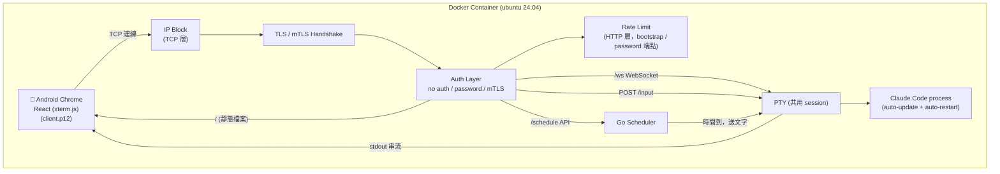
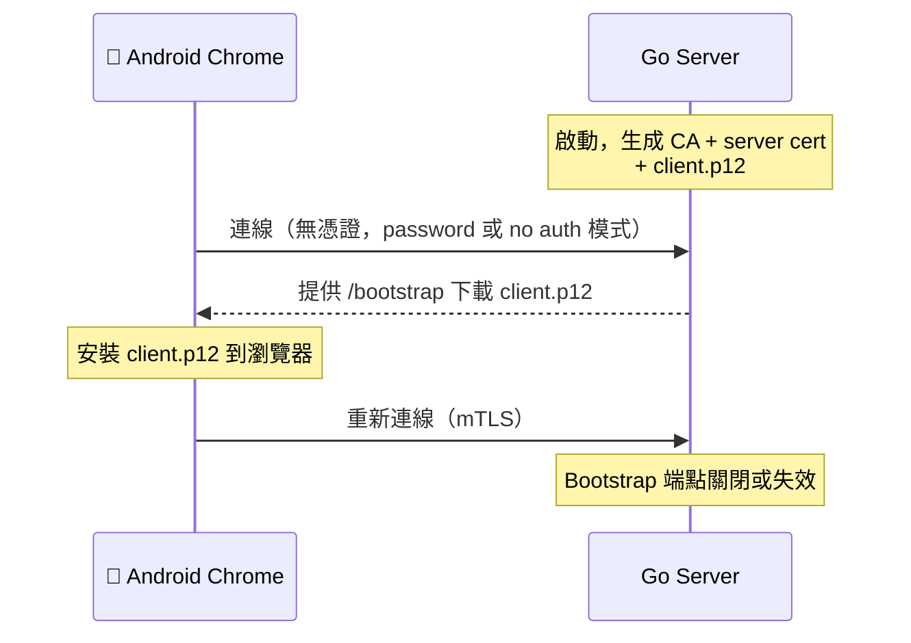
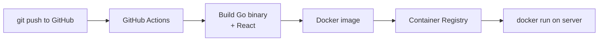

# Claude Code Web Terminal 專案設計

> 記錄日期：2026-04-10

## 背景與動機

**目標**：打造一個 AI Agent 平台，讓 Doro 可以用手機直接完成平常需要在電腦上做的事情——包括寫程式、管理知識庫、處理文件等。

Claude Code 有內建 channel 功能（Discord、Slack 等）和 remote trigger，但有以下限制使其不適合：

1. **Channel 只能文字對話**：看不到完整 terminal 輸出（stdout/stderr、互動式程式的畫面）
2. **Remote trigger 沒有即時串流**：無法觀察 Claude Code 執行中的即時狀態
3. **需要完整 terminal session**：不是聊天介面，而是真正的 terminal，可以看到 Claude Code 完整的工作過程

因此自建一個 web terminal，讓 Doro 在 Android Chrome 上，透過完整的 terminal 介面，即時觀察並操作跑在 server 上的 Claude Code。

## 架構



### Bootstrap 流程（第一次啟動）



> Bootstrap 端點是否關閉、之後是否強制 mTLS，依照 `AUTH_MODE` 環境變數決定。只有 `AUTH_MODE=mtls` 時，bootstrap 下載後端點失效並強制 mTLS。

### CI/CD 流程



## 專案結構

放在 GitHub 上，CI/CD 用 GitHub Actions。

```
project/
├── main.go         # init、log 管理、process 管理、signal 處理
├── pty.go          # PTY 管理：spawn Claude Code、broadcast 輸出、auto-restart
├── scheduler.go    # 排程器：時間到自動送文字指令進 PTY
├── bootstrap.go    # 首次啟動：產生憑證、提供 client.p12 下載
├── tls.go          # TLS/mTLS 設定、憑證自動產生
├── auth.go         # 認證模式（由 Docker env 決定，啟動後不可更改）
├── ipblock.go      # IP block（TCP 層）
├── ratelimit.go    # Rate limit（HTTP 層，bootstrap / password 端點）
├── Dockerfile      # 基底 ubuntu 24.04，含 claude code 安裝
├── .github/
│   └── workflows/
│       └── build.yml   # build image、push 到 registry
└── frontend/
    ├── src/
    │   └── App.tsx  # xterm.js
    └── dist/        # build 後 embed 進 go binary
```

### main.go 職責

**Init**
- 讀取並驗證環境變數（AUTH_MODE 等）
- 初始化 logger
- 產生或載入 TLS 憑證
- 載入 `schedules.json`
- 啟動 Claude Code auto-update（container 啟動時執行一次）

**Log 管理**
- 結構化 log（JSON 格式）
- 同時輸出到 stdout（供 `docker logs`）和 log file（供 volume 持久化）
- Log rotation（避免 log file 無限增長）

**Process 管理**
- 啟動並監控 PTY / Claude Code process
- 啟動 Scheduler
- 啟動 HTTP Server

**Signal 處理**
- `SIGTERM` / `SIGINT`：graceful shutdown（等 WebSocket 連線結束、flush log、關閉 PTY）
- `SIGHUP`：reload（保留，未來可用於重載 config）

> `certs/` 和 `schedules.json` 不放進 repo，由 container 啟動時自動產生，掛 volume 持久化。

## 功能規格

### 認證模式
由 Docker 環境變數在啟動時決定，之後不可更改：

| 模式 | 環境變數 | 說明 |
|------|----------|------|
| 無認證 | `AUTH_MODE=none` | 僅限內網測試 |
| 密碼 | `AUTH_MODE=password` | HTTP 或 HTTPS + 密碼 |
| mTLS | `AUTH_MODE=mtls` | 強制雙向 TLS，正式使用 |

### PTY / Claude Code 管理
- 所有連線共用同一個 PTY session
- Claude Code 崩潰或 exit → 自動重啟
- Claude Code 自動更新（container 啟動時或定期執行 `claude update`）

### 排程器
- Job 持久化存 `schedules.json`，重啟後不遺失
- 管理 API：
  - `POST /schedule` — 新增排程
  - `GET /schedule` — 列出所有排程
  - `DELETE /schedule/:id` — 刪除

```go
type Job struct {
    ID      string `json:"id"`
    Hour    int    `json:"hour"`
    Minute  int    `json:"minute"`
    Message string `json:"message"`
    Repeat  bool   `json:"repeat"` // 每天重複 or 只跑一次
}
```

### xterm.js 前端
- HTTP 連結可點擊（clickable URLs）
- 虛擬鍵盤：overlay 模式和往上縮（resize）模式可切換，預設往上縮
- 視窗縮放：瀏覽器視窗改大小 → 送 `SIGWINCH` 到後端 PTY

### 安全性
- IP block 在 TCP 層（TLS 之前），擋已知惡意 IP
- Rate limit 在 HTTP 層（TLS 之後），只套用在 bootstrap 和 password 登入端點
- Bootstrap 端點一次性，用後失效
- mTLS 模式下強制雙向驗證
